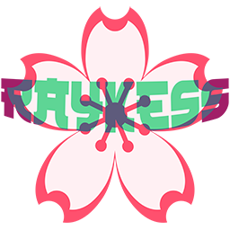

  

<h3 align="center">Anime List website studying project</h3>

  

    project_description
     
    <a href="https://github.com/RaYkeSS/AnimeList/tree/main/src"><strong>Check project</strong></a>
     
     
    <a href="https://github.com/RaYkeSS/AnimeList/issues/new?labels=bug&template=bug-report---.md">Report Bug</a>
    ·
    <a href="https://github.com/RaYkeSS/AnimeList/issues/new?labels=enhancement&template=feature-request---.md">Request Feature</a>
  

<!-- TABLE OF CONTENTS -->

  
Table of Contents

  <ol>
    <li>
      <a href="#about-the-project">About The Project</a>
      <ul>
        <li><a href="#built-with">Built With</a></li>
      </ul>
    </li>
    <li><a href="#plans">Plans</a></li>
    <li><a href="#contact">Contact</a></li>
  </ol>

<!-- ABOUT THE PROJECT -->
## About The Project

[![Anime List website Screen Shot][product-screenshot]](https://raykess.ru)

Project to create a website for creating and evaluating a collection of watched series.

(<a href="#readme-top">back to top</a>)

<!-- Plans -->
## Plans

- [ ] Local Storage
- [ ] Search show more
- [ ] Saving rating
- [ ] Error Page layout
- [ ] Filter

(<a href="#readme-top">back to top</a>)

## Contact

raykess25rus@gmail.com

Project Link: [https://github.com/RaYkeSS/AnimeList](https://github.com/RaYkeSS/AnimeList)

(<a href="#readme-top">back to top</a>)

<!-- MARKDOWN LINKS & IMAGES -->
[product-screenshot]: git/screenshot.png

<!-- Stack -->
[React.js]: https://img.shields.io/badge/React-61DAFB?style=flat&logo=react&logoColor=black
[React-url]: https://reactjs.org/

[ReactRouter]: https://img.shields.io/badge/React_Router-CA4245?style=flat&logo=react-router&logoColor=white
[ReactRouter-url]: https://reactrouter.com/

[Redux]: https://img.shields.io/badge/Redux-764ABC?style=flat&logo=redux&logoColor=white
[Redux-url]: https://redux.js.org/

[tailwindcss]: https://img.shields.io/badge/Tailwind_CSS-06B6D4?style=flat&logo=tailwind-css&logoColor=white
[tailwindcss-url]: https://tailwindcss.com/